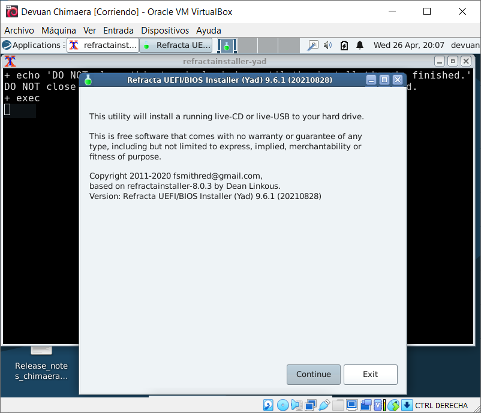
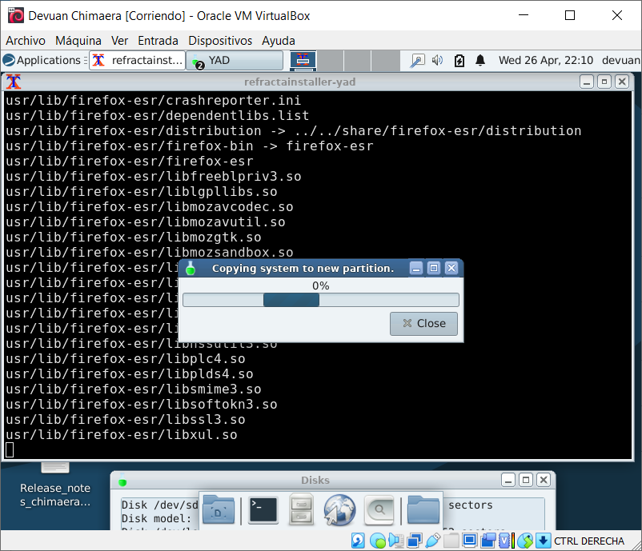
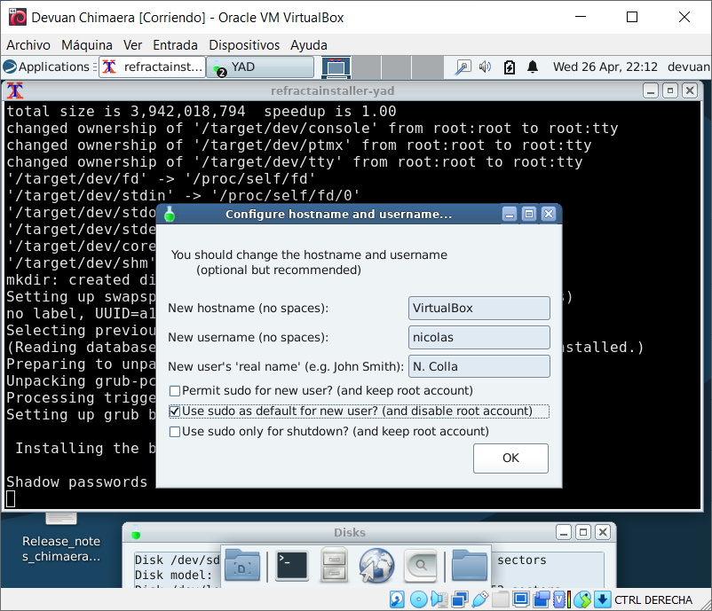
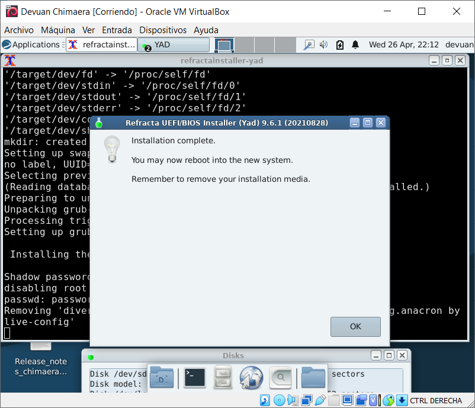
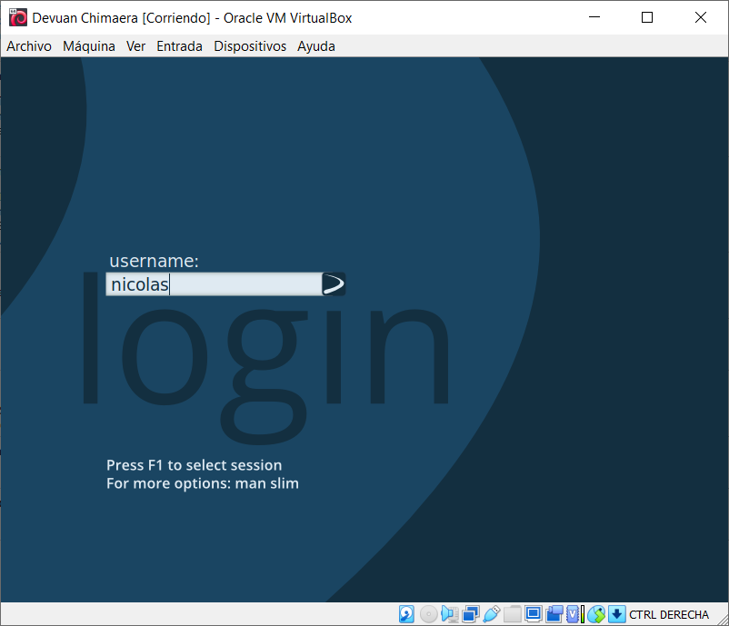
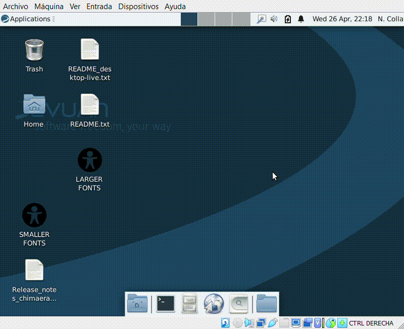
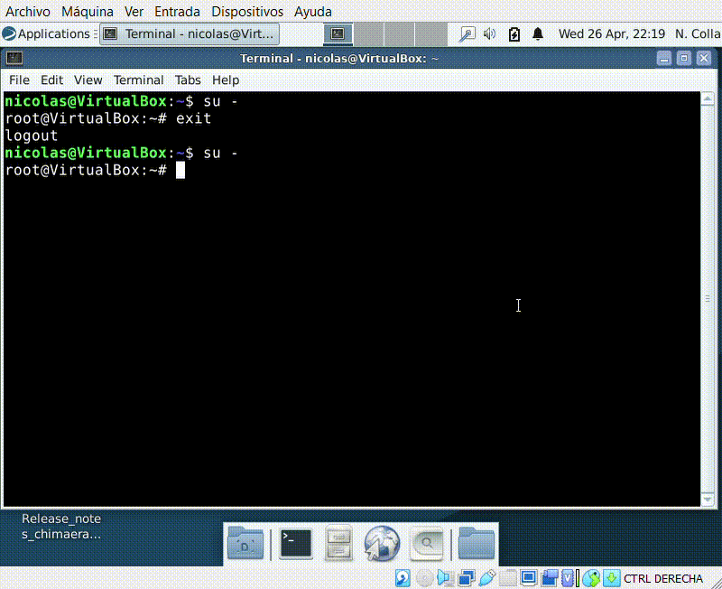

# Possible security issue in Devuan Chimaera?

### Steps to reproduce this bug

-Download the installation iso of Devuan Chimaera [from one of its mirrors](https://mirror.leaseweb.com/devuan/devuan_chimaera/desktop-live/devuan_chimaera_4.0.2_amd64_desktop-live.iso). Boot the iso and run the installer:

-At the end of the installation, create a regular user. Select the option "Use sudo as default for new user? (and disable root account)":

-Reboot after the installation is complete. Boot into the freshly installed system and log in:

### Expected behaviour

The root account should be disabled.

### Actual behaviour

The root account is enabled in the system with a blank password:

It can be used to log in:

